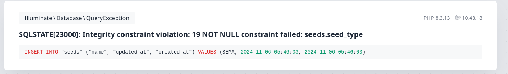
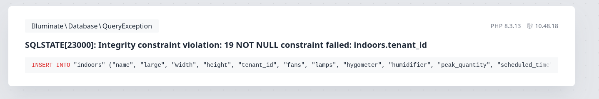

# Archivo environment
si la variable app_name no es Laravel rompe después de la pantalla del login, queda en un 403

# Superadmin

## semillas 
al crearlas rompe porque falta el tipo de semilla en el form, tanto para crear, como para crear y nuevo

## estados de plantas 
acciones, acá es obligatorio tener 1 cargado.
horas de luz (minimo y maximo, cuando deberia ser hs de luz y oscuridad)

# Tenant

## acciones 
no carga desplegable indoor

## indoors 
rompe al darle a guardar, falta el dato tennant_id ?

