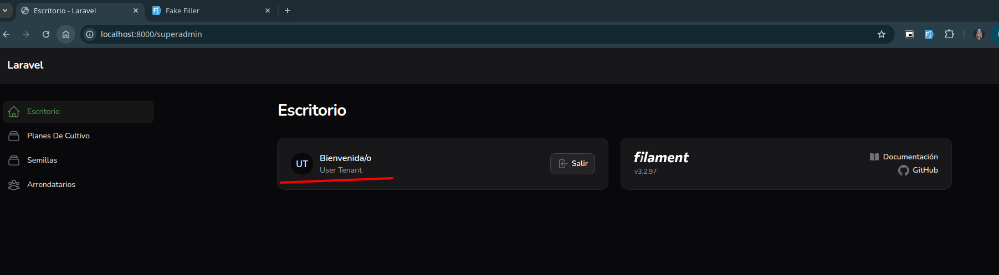

# Version reducida

docker build . -t cannabica-app

docker run --rm -d --name cannabica-core -v $(pwd)/cannabica_db.sqlite:/var/www/cannabica_db.sqlite  -p 8000:8088 cannabica-app 
                                # -v $(pwd)/.:/var/www 

docker run --rm -d --name cannabica-core -v $(pwd)/cannabica_db.sqlite:/var/www/cannabica_db.sqlite -v $(pwd)/.env:/var/www/.env -p 8000:8088 cannabica-app 

docker exec -it cannabica-core bash
        composer require fakerphp/faker:* --ignore-platform-req=ext-zip --no-progress --no-interaction
        php artisan migrate
        php artisan db:seed

## Credenciales de test
/superadmin
test@example.com
password

/tenant
user@tenant.com
password

## Issues generales

- si me logeo como superadmin y voy a /tenant, me devuelve un 403
- si me logeo como tenant y voy a /superadmin, accedo sin problemas
        

