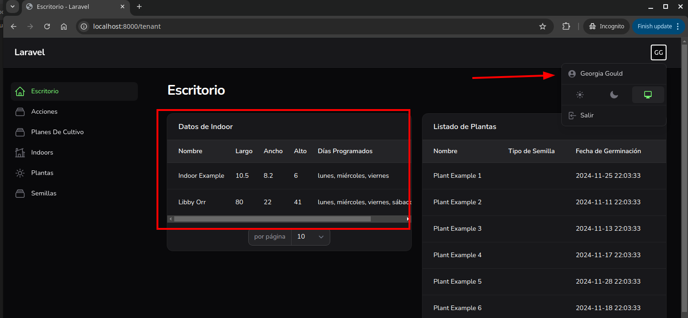
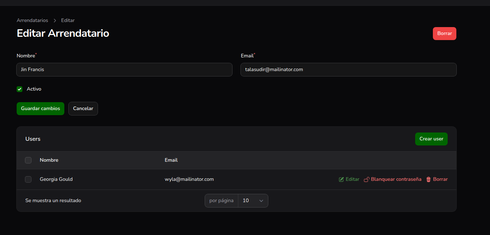

# Menu desplegable

- escritorio
    - boton de usuario
    #MUST quitar boton filament
- planes de cultivo
    - same tenant.md
- semillas
- arrendatarios
    
    
# Arrendatarios

## listado
- nombre
- email
- checkbox (activo)

## crear arrendatario
- nombre
- email
- checkbox (activo)
- listado usuarios
    - nombre
    - email
    - blanquear la contraseña

# Issues

- todas las entradas se comparten entre arrendatarios

