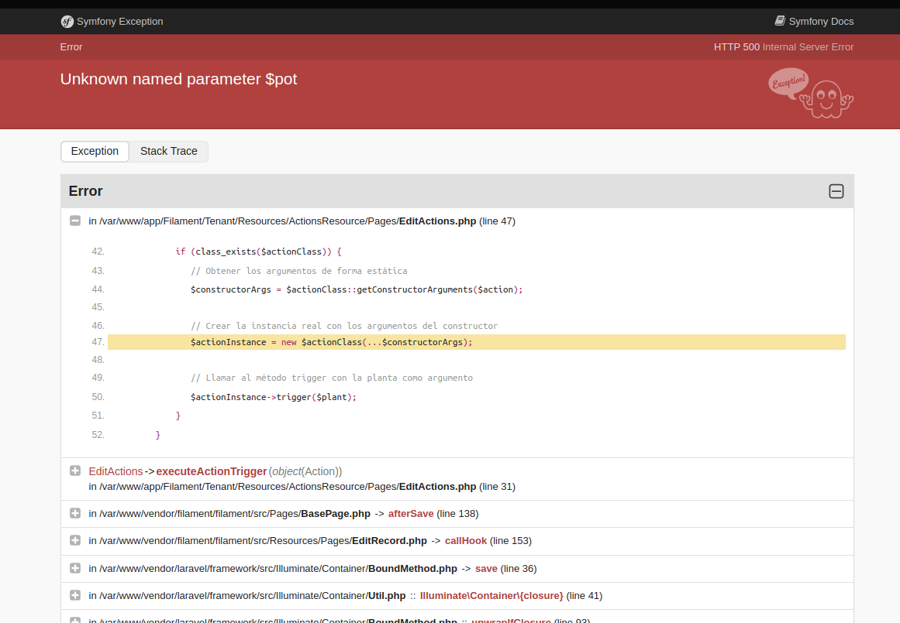
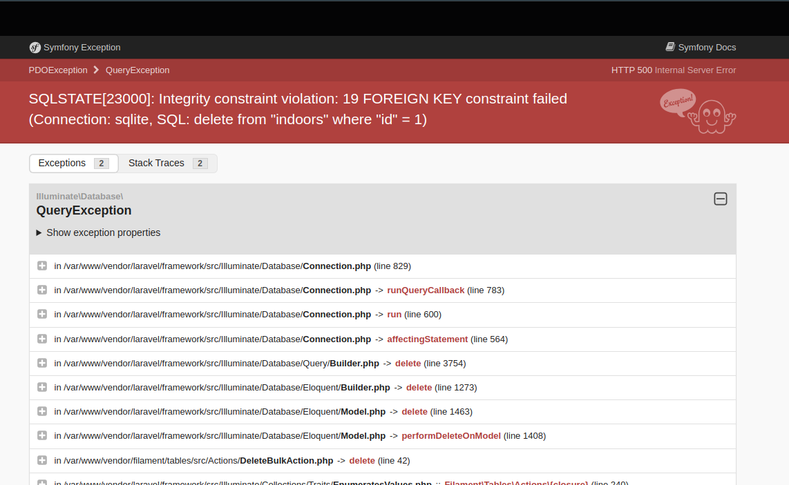

# Menu desplegable

- escritorio
- acciones
- planes de cultivo
- indoors
- plantas
- semillas

# escritorio

## Datos del indoor

- nombre
- largo
- arncho
- alto
- dias programados de riego

## listado de plantas

- nombre
- tipo de semilla
- fecha de germinacion
#MUST agregar filtros para listado de plantas?

# acciones

## Listado
#MUST agregar indoor implicado a los datos mostrados de las acciones

## crear accion

#MUST después de haber creado la accion, no se tiene que poder cambiar el tipo de accion
- fecha
- tipo de accion
    - registrar riego
        - tipo de riego
            - riego abierto por tiempo
            - cantidad de litros de agua por maceta
    - registrar poda
        - tipo de poda [excedente de hojas, hojas amarillas o secas, apical, topping, scrog]
    - registrar aplique de productos
        - tipo de producto [para etapa vegetativa, para etapa de floracion, para etapa de plantula,anti-plaga,~~lavado con jabon potasico~~, otro]
        - observaciones
        - comentarios
        #MUST agregar foto
        #MUST agregar checkbox para indicar que se debe repetir la accion en una semana y crear evento de recordatorio
    - registrar transplante
        #MUST que pasa si se tiene seleccionada mas de una maceta con valores diferentes de maceta actual?
            - rompió, registro en [issue numero 2](###issues)
        #MUST traer listado de plantas seleccionadas con sus respectivas macetas actuales
        - maceta actual
        - maceta nueva
        __issue 5: el transplante no se guarda en la vista de la planta, solo aparece como accion registrada__
    - registrar observacion
        - imagen
        - comentarios
    - registrar muerte de planta
        __issue 3: la planta seleccionada no cambia el estado a muerta__
        __issue 4: al registrar una planta como muerta, no se elimina de la lista de plantas que se traen con el indoor__
   #MUST registrar medicion de ph
- seleccionar indoor
    - todas las plantas
    - selección de plantas

# planes de cultivo

## Listado

    - no se ve ningún plan de cultivo, en el listado por defecto.
        #MUST Debería verse en el listado el plan de cultivo creado por defecto en modo solo lectura y poder clonarlo?
    - cuando hay uno creado no se ve el nombre del plan en la primera columna

## Crear plan de cultivo
#MUST devolver a la pantalla de listado de plan de cultivo luego de crear uno nuevo
    - nombre
    - datos generales
        - descanso sugerido entre podas (en dias)
        - descanso entre festilizaciones (en dias)
        - cantidad de dias para dejar de fertilizar antes de la fecha de corte (en dias)
        - irrigacion sugerida (en porcentaje por tamaño de maceta)
    - etapa de germinacion
        - periodo de dias sugerido
            - desde
            - hasta
        - tiempo de iluminacion
            - horas de luz
            - horas de oscuridad
        - humedad recomendada
            - desde
            - hasta 
        - temperatura recomendada
            - desde
            - hasta 
    - etapa plantula
        - periodo de dias sugerido
            - desde
            - hasta 
        - tiempo de iluminacion
            - horas de luz
            - horas de oscuridad
        - humedad recomendada
            - desde
            - hasta 
        - temperatura recomendada
            - desde
            - hasta
    - etapa de vegetacion
        - periodo de dias sugerido
            - desde
            - hasta 
        - tiempo de iluminacion
            - horas de luz
            - horas de oscuridad
        - humedad recomendada
            - desde
            - hasta 
        - temperatura recomendada
            - desde
            - hasta 
    - etapa de floracion
        - periodo de dias sugerido
            - desde
            - hasta 
        - tiempo de iluminacion
            - horas de luz
            - horas de oscuridad
        - humedad recomendada
            - desde
            - hasta 
        - temperatura recomendada
            - desde
            - hasta 

# indoor    

## Listado

#MUST agregar medidas de indoor ademas de nombre
__issue 6: se puede borrar el indoor de ejemplo, rompiendo__

## Crear indoor
#MUST devolver a la pantalla de listado de indoor luego de crear uno nuevo

- nombre
- medidas
    - largo
    - ancho
    - alto
- ventiladores (es una coleccion de ventiladores)
    - pulgadas
- lamparas (es una coleccion de lamparas)
    - watts
    - tipo de lampara (led, sodio)
    - area de cobertura #MUST quitar required
    - observaciones
- checkbox para indicar si tiene higometro para medir humedad y temperatura
- checkbox para indicar si tiene algun humidificador
#MUST agregar checkbox para indicar si tiene algun filtro de aire
#MUST agregar checkbox para indicar si tiene algun medidor de ph
- riego automatico
    - cantidad de picos en cada maceta
    - minutos programados de riego
    - cantidad de veces al dia que se riega
    - dias programados de riego (es una coleccion de dias, lun-dom)

# Plantas

## Listado
#MUST cambiar fecha de germinacion por cantidad de dias transcurridos desde la germinacion(dias de vida, edad o algo asi)
#MUST agregar etapa de la planta
#MUST mostrar que indoor pertenece la planta
#MUST agregar filtros para listado de plantas, por indoor

## Crear planta
#MUST devolver a la pantalla de listado de plantas luego de crear una nueva
- indoor
- nombre de la planta
- tipo de semilla (traido de la lista de semillas)
- estado de la planta
- fecha de germinacion
- maceta y sustrato
    - tipo de maceta (geotextiles, plasticas, bolsones)
    - capacidad de litros
- suelo base
    - checkbox (turba, guano, estiercol, polvo de roca, arena, fibra de coco, abono naturales, corteza de pono, perlita, vermiculita)
- enriquecimiento del suelo
    - checkbox (Posos de café y/o te, Cascaras de huevo, Humus de lombriz, Pieles de frutas y verd, Abono, Fibra de coco, Perlita, Vermiculita, Arena, Harina de huesos, Harina de sangre, Roca fosfórica, Cal )

# Semillas

## Listado

## Crear semilla
- nombre
- tipo de semilla (fotoperiodica feminizada,fotoperidica regular, automatica)
- tiempo de floracion en semanas
- ratio thc %
- ratio cbd %
- observaciones

### issues
1. _al crear la accion, no nos lleva a la pantalla de listado de acciones_
2. _que pasa si se tiene seleccionada mas de una maceta con valores diferentes de maceta actual?_
    primero registré una maceta random, después cambié indoor seleccionado, después volví al indoor example y seleccioné todas las macetas y las cargué a un valor cualquiera.
    
3. la planta seleccionada no cambia su estado a muerta
4. al registrar una planta como muerta, no se elimina de la lista de plantas que se traen con el indoor
5. el transplante no se guarda en la vista de la planta, solo aparece como accion registrada
6. se puede borrar el indoor de ejemplo, rompiendo
    
